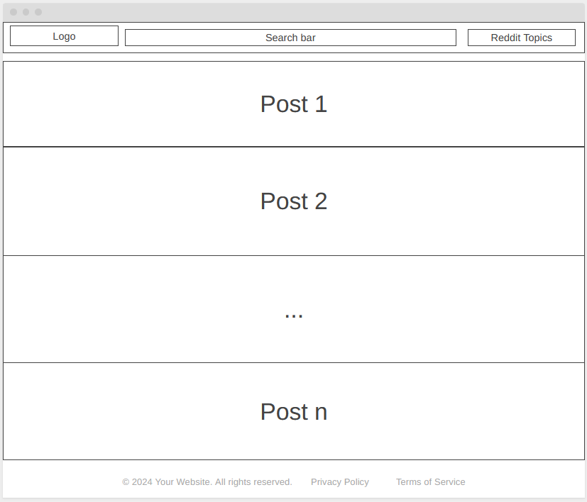

# Reddit Reader web app

## Overview

This project comes from CodeCademy front-end developer path.
It's purpose is to get hands on practice of creating a front end application that uses API calls to gather data that is displayed for the user.
In this project we will use different frameworks and languages that are used for web and front-end developnemt.

Project will get data from reddit using API calls and give user a chance to display posts (and comments) from different topics.

## Project Requirements:

- [x] Build the application using React and Redux
- [x] Version control your application with Git and host the repository on GitHub
- [x] Use a project management tool (GitHub Projects, Trello, etc.) to plan your work
- [x] Write a README (using Markdown) that documents your project including:

  - Wireframes
  - Technologies used
  - Features
  - Future work

- [ ] Write unit tests for your components using Jest and Enzyme
- [ ] Write end-to-end tests for your application
- [ ] Users can use the application on any device (desktop to mobile)
- [ ] Users can use the application on any modern browser
- [ ] Users can access your application at a URL
- [ ] Users see an initial view of the data when first visiting the app
- [ ] Users can search the data using terms
- [ ] Users can filter the data based on categories that are predefined
- [ ] Users are shown a detailed view (modal or new page/route) when they select an item
- [ ] Users are delighted with a cohesive design system
- [ ] Users are delighted with animations and transitions
- [ ] Users are able to leave an error state
- [ ] Get 90+ scores on [Lighthouse](https://pagespeed.web.dev/)

  - We understand you cannot control how media assets like videos and images are sent to the client. It is okay to have a score below 90 for Performance if they are related to the media from Reddit.

- [ ] **OPTIONAL**: Get a custom domain name and use it for your application
- [ ] **OPTIONAL**: Set up a CI/CD workflow to automatically deploy your application when the master branch in the repository changes
- [ ] **OPTIONAL**: Make your application a progressive web app

## Tools used for the project

Frameworks, tools and programming languages used for the project:

- React
- Redux
- JavaScript (TypeScript)
- HTML
- CSS
- Reddit API
- GitHub

## Project plan

Below are some high-level points for the project. This document will be updated throughout the project as new features are developed and introduced.

- Project will be managed in GitHub. GitHub issues will be used to map tasks that need to be done and bugs that require fixing.
- Wireframes will be created before we start coding application
- Set up CI/CD pipeline in GitHub for this project
- As we are writing code for application we will be developing test cases to make sure that new features work as expected and they don't break anything we have created before. For this purpose Jest and Enzyme will be used
- Create API request handling to get data from Reddit
- Create components for the web application
- Style application so it would be intuitive to use and easily accessible to everyone.

## Wireframe - how will app look like

Below are the wireframe of how I imagine my Reddit reader to look like.


App will consist of 3 main parts - header, content and footer. In header user will see a logo of 'Reddit Reader' (left) and search bar, which he will be user to search for posts in the sub-section (middle). Also a a drop-down list of reddit topics available will be displayed in header (right side).
In content section app will display posts that are retrieved from reddit API after user has selected a sub-topic.
And finally in the footer section I will include year when this app was created and some other basic not so interesting information...

## Project work

### Starting project

Project was started by using a node.js recat template which has all the necessary frameworks already set up:

- **React** to build beautiful front-end web app
- **Redux** to manage states for the application and we would be displaying the right data
- **Jest (Enzyme)** to create and run tests as we develop the app

To set up the project from the template I followed the steps below:

1. Open command line line
2. Navigate to folder in which you want your project to be
3. Run command
   `npx degit reduxjs/redux-templates/packages/vite-template-redux my-app`
   Replacing **my-app** with a name of your application
4. Navigate into the newly created **my-app** folder
5. Run command `npm install` to install all the dependencies project will be using

### Setting up remote repo

After all the initial setup work is done we create a repo (locally and on github)

- From command line while in the project folder run command `git init` to initialize the local repository
- On [github](www.github.com) create an empty repository
- Go back to command line and run command
  `git remote add origin <link to remote github repo repo>`
- (Optional) change name of local master branch to main `git branch -m master main`
- Stage changes with command `git add *`
- Make initial commit `git commit -m "Initialize project"`
- Push initial project setup to remote github repo `git push --set-upstream origin main`

### Adding routing

For a good craic I decided to add some routing, so that user would see changes in the browsers URL as he changes reddit topic. For this to be possible there were several steps to be taken:

- We need to install 'react-router-dom' using command `npm install --save react-router-dom`
- After we have added 'react-router-dom' to our project we can start implementing the feature. I was taking advantage of **useNavigate()** function to make URL changes when user picks a topic.
- I also had to make changes in **main.tsx** to support app's rendering on different routes. I used nested routes and a placeholder value to represent differnet routes and which components we want to render for each route. (This application is simple, so we pretty much render same component for all routes)
- Trickiest part about adding routes came for the tests. Adding **useNavigate()** broke all test cases that were rendering components... To fix that I needed to render components between BrowserRouter tags as in example below:
  **&lt;BrowserRouter>** &lt;Component> **&lt;/BrowserRouter>**

---

# vite-template-redux

Uses [Vite](https://vitejs.dev/), [Vitest](https://vitest.dev/), and [React Testing Library](https://github.com/testing-library/react-testing-library) to create a modern [React](https://react.dev/) app compatible with [Create React App](https://create-react-app.dev/)

```sh
npx degit reduxjs/redux-templates/packages/vite-template-redux my-app
```

## Goals

- Easy migration from Create React App or Vite
- As beginner friendly as Create React App
- Optimized performance compared to Create React App
- Customizable without ejecting

## Scripts

- `dev`/`start` - start dev server and open browser
- `build` - build for production
- `preview` - locally preview production build
- `test` - launch test runner

## Inspiration

- [Create React App](https://github.com/facebook/create-react-app/tree/main/packages/cra-template)
- [Vite](https://github.com/vitejs/vite/tree/main/packages/create-vite/template-react)
- [Vitest](https://github.com/vitest-dev/vitest/tree/main/examples/react-testing-lib)
